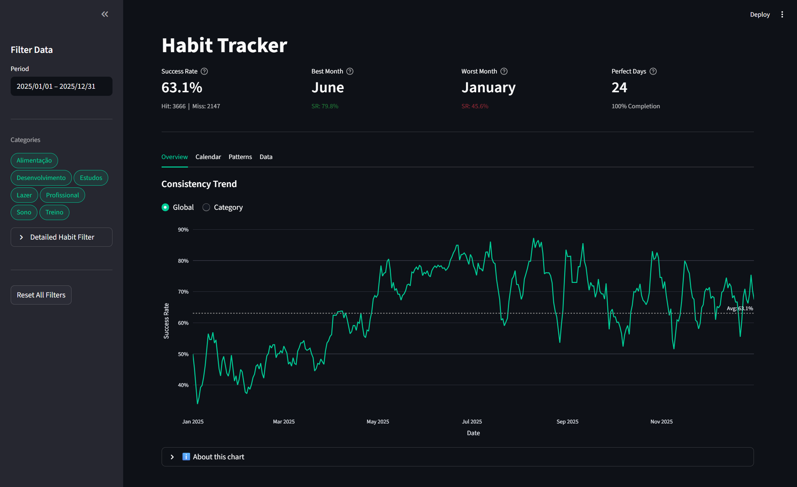
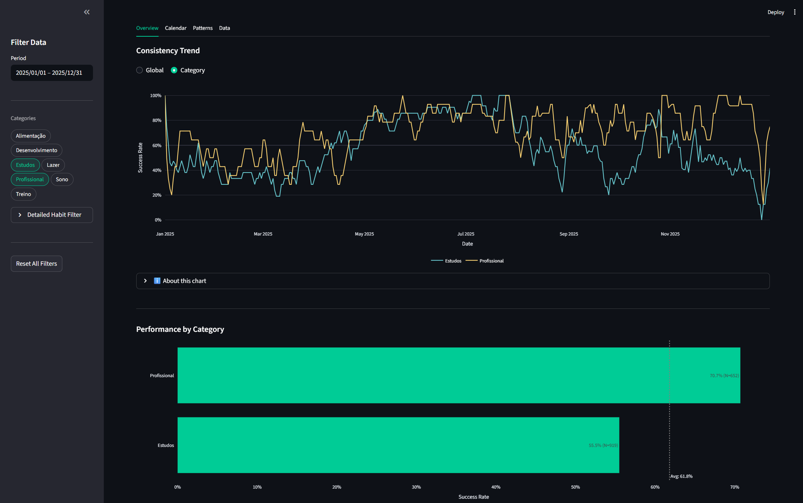
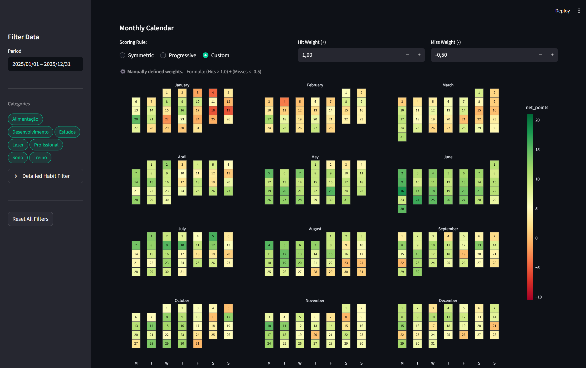
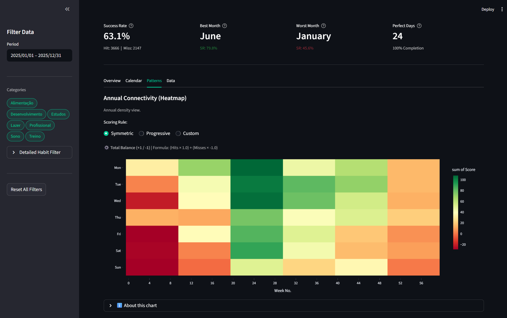
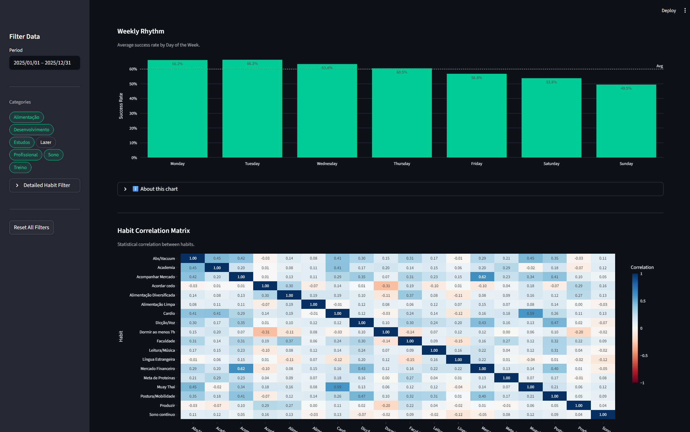

# 📈 Habit Tracker: Data-Driven Discipline

[](https://www.python.org/)
[](https://streamlit.io/)
[](https://plotly.com/)
[](https://pandas.pydata.org/)

> **A full-stack data application converting daily habits into actionable insights using Python, ETL pipelines, and interactive storytelling.**



---

## 🧐 About The Project

This project is a specialized BI dashboard designed to track, analyze, and visualize personal performance metrics.

> **🔒 Privacy Disclaimer:** The data presented in the screenshots has been **perturbed** (anonymized and randomized) for demonstration purposes to protect sensitive personal information.

Unlike standard mobile apps, this tool focuses on **Analytical Depth**. It allows the user to drill down into specific categories (Health, Work, Study), understand weekly rhythms, and visualize consistency over long periods.

### 🎯 Key Objectives
* **ETL Automation:** Seamlessly ingest and clean raw data using a custom pipeline.
* **Dynamic Storytelling:** Visuals that adapt to user filters (Date Range, Category, Specific Habits).
* **Behavioral Economics:** Custom scoring logic (Symmetric, Progressive and Custom) to incentivize consistency and prevent burnout.

---

## 📊 Dashboard Features

### 1. KPI & Trend Analysis
The landing page provides an immediate health check of the user's routine.
* **7-Day Moving Averages:** Used to smooth out daily volatility and show the true trend direction.
* **Category Drill-Down:** Users can toggle between a Global view and a Category comparison to see which areas of life are performing best (e.g., Professional vs. Studies).



### 2. The Wall Calendar
A classic visual management tool reimagined with code.
* **Context-Aware Coloring:** The color scale adapts dynamically based on the number of active habits selected.
* **Custom Scoring Engine:** Users can define their own weights (e.g., Penalizing misses heavily vs. rewarding volume).



### 3. Pattern Recognition & Advanced Analytics
This section leverages statistical methods to uncover hidden behaviors.
* **Annual Heatmap:** A density plot to identify long-term consistency gaps and seasonal drops in productivity.
* **Weekly Rhythm:** Bar charts identifying the user's most productive days of the week (e.g., identifying "Monday Momentum" vs. "Weekend Slump").
* **Correlation Matrix:** A Pearson correlation heatmap to analyze how one habit influences another (e.g., *"Does waking up early correlate positively with studying?"*).

| Annual Density | Statistical Correlation |
| :---: | :---: |
|  |  |

---

## 🛠️ Technical Stack

* **Core:** Python 3.11+
* **Frontend / UI:** Streamlit (Custom CSS injection for Dark Mode & Minimalist UI).
* **Data Processing:** Pandas (Grouping, Rolling Windows, Pivot Tables).
* **Visualization:** Plotly Express (Interactive tooltips, Spike lines, Density Heatmaps).
* **Architecture:** Modular design separating ETL logic from UI components.

### Folder Structure
```bash
├── etl/
│   ├── connection.py    # Raw data ingestion
│   └── processor.py     # Data cleaning and transformation
├── interface/
│   ├── charts.py        # Reusable Plotly figure functions
│   └── kpis.py          # Metric calculations
├── main.py              # Application entry point
├── requirements.txt     # Dependencies
└── README.md            # Documentation
```
---

## 🧠 Design & Business Logic

One of the core challenges in this project was defining "Success" in a quantifiable way. To solve this, I implemented a flexible scoring engine based on Behavioral Economics principles:

1.  **Symmetric Rule (+1 / -1):** A zero-sum game. Good for building strict discipline where consistency is key.
2.  **Progressive Rule (+1 / -0.5):** Focuses on "Growth Mindset." A miss penalizes the score, but doesn't erase all progress made by previous hits.
3.  **Context-Aware Scaling:** The dashboard automatically adjusts its color scales. If a user filters for a single habit, 100% performance is calculated based on that specific habit's history, rather than the global total.

---

## 🚀 How to Run

1.  **Clone the repository**
    ```bash
    git clone [https://github.com/PedruMota/habit-tracker.git](https://github.com/PedruMota/habit-tracker.git)
    cd habit-tracker
    ```

2.  **Install dependencies**
    ```bash
    pip install -r requirements.txt
    ```

3.  **Run the App**
    ```bash
    streamlit run main.py
    ```

---

## 📬 Contact

[](https://linkedin.com/in/pedro-mota-864084204/)
[](mailto:pedroaamota@outlook.com)

---
*Note: This project is part of my portfolio to demonstrate full-cycle data application development. Actual user data presented in the screenshots has been perturbed for privacy purposes.*