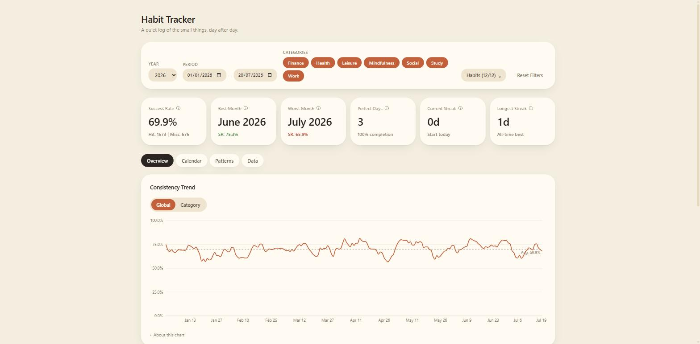
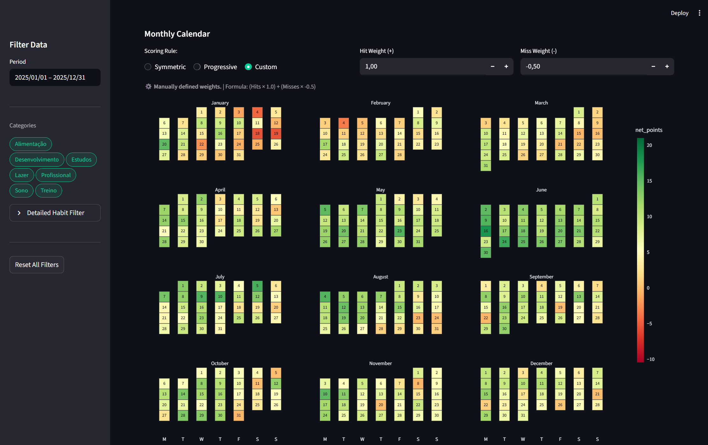
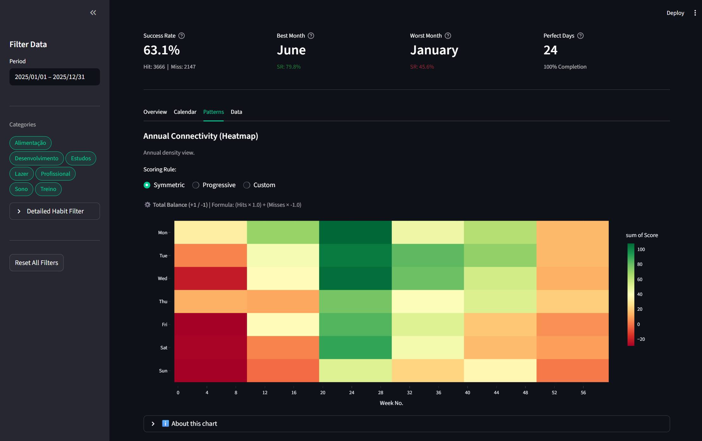

# 📈 Habit Tracker

[](https://react.dev/)
[](https://www.typescriptlang.org/)
[](https://vite.dev/)
[](https://tailwindcss.com/)
[](https://recharts.org/)

> **A personal analytics dashboard that turns a year of daily habit-tracking into a story: trends, streaks, a wall calendar, and the statistical relationships between habits.**



> **Privacy note:** the screenshots and the data shipped in this repo are **synthetic** — a randomly generated sample dataset built to match the shape of the real thing, not the author's actual habit history. See [Data & privacy](#data--privacy).

---

## Why this exists

This started as a [Streamlit](https://streamlit.io/) app — a fast way to turn a personal Google Sheets habit log into charts. It worked, but it looked like every other Streamlit app: same sidebar, same dark theme, same widget chrome. Once the data pipeline and the analysis logic were solid, the natural next step was to **rebuild the entire frontend in React** — not just re-skin it, but actually own the rendering layer: port every aggregation from pandas to TypeScript by hand, design a real visual identity instead of a framework default, and ship something that reads as a considered product rather than a generated dashboard.

The original Streamlit build still lives in this repo (see [Original Streamlit version](#original-streamlit-version-v1)) — partly for history, partly because the Python ETL pipeline it documents is still the reference for the data shape the React app consumes.

## What's in the dashboard

- **Overview** — a 7-day moving average trend line (global or split by category), plus a ranked bar chart of success rate per life area.
- **Calendar** — a classic monthly wall calendar, colored by a configurable scoring engine (see below).
- **Patterns** — a GitHub-style annual density heatmap, a "which day of the week am I actually good at this" bar chart, and a Pearson correlation matrix between habits (pairwise, rest days excluded).
- **Data** — the raw filtered log, for when a chart isn't enough.
- Filters cascade the same way across all four tabs: year → date range → category → individual habit, with a one-click reset.

### What's new compared to the Streamlit version

- **Streak metrics.** The original had no concept of a streak at all — odd, for a habit tracker. The React version adds *current streak* and *longest streak* (consecutive "perfect days," gaps in the log count as a break).
- **Fixed a real bug.** "Best/Worst Month" used to group by month *name* only, so January 2025 and January 2026 got silently averaged together once the data spanned more than one year. Now grouped by year+month.
- **Colorblind-safe palette.** The heatmap/calendar/correlation views used Plotly's `RdYlGn`/`RdBu` scales, which are not reliable for red-green color blindness. They're replaced with a validated categorical/sequential/diverging palette (checked for CVD-safe contrast, not just eyeballed).
- **Explicit multi-year date parsing.** The original relied on pandas inferring the year from a `dd/mm` string; the TS port builds the date directly from the row's tagged year, which is unambiguous by construction.
- **A visual identity, not a template.** Warm cream surfaces, soft shadow elevation instead of boxed borders, pill-shaped controls — a deliberate move away from the dark-mode "admin panel" look that most data dashboards default to.

## Data & privacy

The original app reads live from a private Google Sheet via a service-account credential (`credentials.json`, git-ignored, never committed). That data is personal and stays personal.

This repo ships instead with `frontend/src/data/sample-raw.json` — a **synthetic, seeded, anonymized dataset** (19 months, 12 habits across 7 categories) generated to mimic the exact shape of the real export: one row per habit per month-sheet, one column per day, values in `{"1", "0", "-"}` for hit / miss / rest. It's built with realistic weekday effects, a slow improving trend, and cross-habit correlation (so the correlation matrix has something real to show), but none of it is the author's actual history.

If you want to point this at your own data: the ETL (`frontend/src/lib/etl.ts`) expects exactly that shape, so swapping `sample-raw.json` for your own export — or writing a small backend that proxies your Google Sheet into the same JSON shape — is the only integration point.

## Scoring engine

Both the Calendar and the Patterns heatmap run through the same "behavioral economics" scoring widget: pick a preset (**Symmetric**: +1 hit / −1 miss, a strict zero-sum view; **Progressive**: +1 / −0.5, rewards volume without erasing progress on a bad day) or define custom weights. Rest days (`-`) never count for or against you. The color scale is **context-aware** — its range is recomputed from however many habits are currently selected in the filters, so "100%" always means "everything you tracked today," not some fixed historical maximum.

## Tech stack

**Current (React dashboard)** — `frontend/`
- React 19 + TypeScript, built with Vite
- Tailwind CSS v4 for styling
- Recharts for the trend/bar/weekly-rhythm charts; the wall calendar, annual heatmap, and correlation matrix are hand-built (no charting library covers those shapes well)
- No backend — the whole ETL pipeline (melt, habit-name remapping, date parsing, score derivation) runs client-side in `lib/etl.ts`, ported line-for-line from the original pandas code

**Legacy (Streamlit v1)** — repo root
- Python, Streamlit, Pandas, Plotly, gspread (Google Sheets API)

## Project structure

```
habit-tracker/
├── frontend/                 # the React dashboard (start here)
│   ├── src/
│   │   ├── lib/
│   │   │   ├── etl.ts         # wide→long melt, habit remap, date parsing, scoring
│   │   │   ├── stats.ts       # KPIs: success rate, best/worst month, streaks
│   │   │   ├── aggregations.ts# trend/category/heatmap/calendar/correlation math
│   │   │   ├── scoring.ts     # Symmetric/Progressive/Custom scoring engine
│   │   │   └── colors.ts      # categorical/sequential/diverging color scales
│   │   ├── components/
│   │   │   ├── charts/        # TrendChart, CategoryBarChart, WallCalendar, ...
│   │   │   ├── FilterBar.tsx  # year / date range / category / habit filters
│   │   │   └── ui.tsx         # Card, Pills, Tabs, StatTile, ...
│   │   └── data/sample-raw.json
│   └── package.json
│
├── main.py                   # Streamlit v1 entry point
├── etl/                      # Streamlit v1: Google Sheets connection + pandas ETL
├── interface/                # Streamlit v1: Plotly chart builders + KPI logic
├── notebooks/                # data integrity sandbox for the v1 pipeline
└── assets/                   # README screenshots (react/ = new, root = v1)
```

## Getting started

```bash
git clone https://github.com/PedruMota/habit-tracker.git
cd habit-tracker/frontend
npm install
npm run dev      # http://localhost:5173, loads the bundled sample dataset
npm run build    # production build
```

No environment variables, no API keys, no backend to stand up — it's a static app.

## Roadmap

- Deploy a static demo (Vercel/Netlify)
- Optional serverless proxy for readers who want to connect their own live Google Sheet
- Code-split the Recharts bundle (it's currently the largest chunk in the build)

---

## Original Streamlit version (v1)

The first version of this project — kept in the repo root, unmodified — is a read-only analytics dashboard powered by a live ETL pipeline connected to Google Sheets.

<table>
<tr>
<td></td>
<td></td>
</tr>
</table>

**Stack:** Python 3.11+, Streamlit, Pandas, Plotly, gspread.

**Run it:**
```bash
pip install -r requirements.txt
streamlit run main.py   # requires your own credentials.json (Google service account)
```

---

## Contact

[](https://linkedin.com/in/pedro-mota-864084204/)
[](mailto:pedroaamota@outlook.com)

*Part of my portfolio, demonstrating full-cycle data application development — from ETL pipeline to a from-scratch React frontend.*
